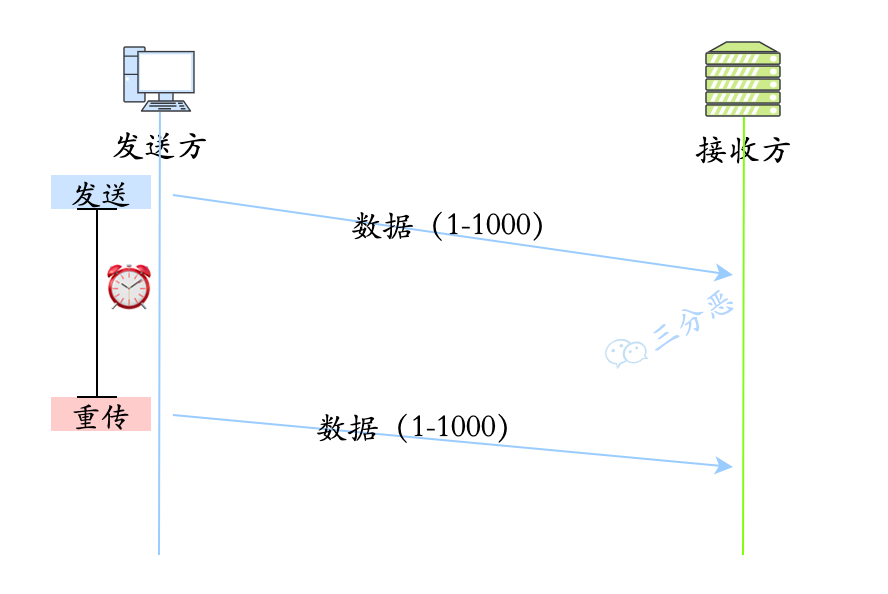

# 基础

## 说下计算机网络体系结构

计算机网络体系结构通过将复杂的网络通信分解成不同的层次，来标准化交互的过程。常见的模型给包括**OSI七层模型**、**TCP/IP四层模型**和**五层体系结构**。


OSI 是理论上的网络通信模型，TCP/IP 是实际应用层面上的网络通信模型，五层结构是为了方便理解和记忆。


## 详细介绍下OSI七层模型

**应用层**

- 最靠近用户的层，负责处理特定的应用程序细节。这一层提供了**网络服务与用户应用软件之间的接口**。例如，Web 浏览器、FTP 客户端和服务器、电子邮件客户端等。

**表示层**

- 确保从一个系统发送的信息可以被另一个系统的应用层读取。它负责**数据的转换、压缩和加密**。例如，确保数据从一种编码格式转换为另一种，如 ASCII 到 EBCDIC。

**会话层**

- 管理用户的会话，控制网络上两节点间的对话和数据交换的管理。它负责**建立、维护和终止会话**。例如，建立一个会话令牌，以便在网络上的两个节点之间传递。

**传输层**

- 提供**端到端的通信服务**，保证数据的完整性和正确顺序。这一层包括 TCP 和 UDP 等。

**网络层**

- 负责在**多个网络之间进行数据传输**，确保数据能够在复杂的网络结构中找到从源到目的地的最佳路径。这层使用的是 IP（Internet Protocol）协议。

**数据链路层**

- 在物理连接中提供可靠的传输，**负责建立和维护两个相邻节点间的链路**。包括帧同步、MAC（媒体访问控制）。

**物理层**

- 负责**在物理媒介上实现原始的数据传输**，比如电缆、光纤和无线信号传输。涉及的内容包括电压、接口、针脚、电缆的规格和传输速率等。


## 详细介绍下TCP/IP四层模型

**应用层**：直接面向用户和应用程序，提供各种网络服务。它包含了用于特定应用的协议和服务，如 HTTP（HyperText Transfer Protocol）、FTP（File Transfer Protocol）、SMTP（Simple Mail Transfer Protocol）等。

**传输层**：提供端到端的通信服务，确保数据可靠传输。它负责分段数据、流量控制、错误检测和纠正。常见的传输层协议有 TCP 和 UDP。

**网络层**：负责在不同网络之间路由数据包，提供逻辑地址（IP 地址）和网络寻址功能。用于处理数据包的分组、转发和路由选择，确保数据可以从源端传输到目标端。

**网络接口层**：链路层（Link Layer），负责将数字信号在物理通道（网线）中准确传输，定义了如何在单一网络链路上传输数据，如何处理数据帧的发送和接收，包括物理地址（MAC 地址）的解析。


## 详细介绍下五层体系结构

是对 OSI 和 TCP/IP 的折衷，它保留了 TCP/IP 的实用性，同时提供了比四层模型更细致的分层，便于教学和理解网络的各个方面。


## 每一层对应的网络协议有哪些


## 数据在各层之间是怎么传输的

对于发送方：从上层到下，层层包装

对于接收方：从下层到上层，层层解开包装


- 发送方的应用进程向接收方的应用进程传送数据
- AP 先将数据交给本主机的应用层，应用层加上本层的控制信息 H5 就变成了下一层的数据单元
- 传输层收到这个数据单元后，加上本层的控制信息 H4，再交给网络层，成为网络层的数据单元
- 到了数据链路层，控制信息被分成两部分，分别加到本层数据单元的首部（H2）和尾部（T2）
- 最后的物理层，进行比特流的传输


# 网络综合

## 从浏览器地址栏输入url到显示网页的过程了解吗

这个过程包括了多个步骤，涵盖了DNS解析、TCP连接、发送HTTP请求、服务器处理请求并返回HTTP响应、浏览器处理响应并渲染页面等多个环节。


**1. DNS解析**

浏览器需要把域名转换成服务器IP地址

- 浏览器检查**本地DNS缓存**
- 如果缓存没有，查询**操作系统的DNS解析器**
- 如果本地没有，向**本地DNS服务器**发送查询请求
- 本地DNS服务器可能缓存了该域名的IP地址，否则向**根DNS服务器**请求
- 根DNS服务器返回**顶级域名服务器**（.com服务器）的地址
- 顶级域名服务器告诉本地 DNS 服务器去找 **权威 DNS 服务器**（example.com 的 DNS 服务器）。
- 权威DNS服务器返回example.com的IP地址

**2. TCP连接**

浏览器使用**TCP三次握手**连接服务器

- **客户端 → 服务器**：发送 `SYN` 请求，表示要建立连接。

- **服务器 → 客户端**：返回 `SYN-ACK`，表示同意建立连接。

- **客户端 → 服务器**：返回 `ACK`，连接建立。

**3. 发送HTTP/HTTPS请求**

- **如果是 HTTPS**，在 TCP 连接后会先进行 **TLS/SSL 握手**（加密通信）。

- 发送 `GET` 请求：

  ```http
  GET / HTTP/1.1
  Host: www.example.com
  User-Agent: Mozilla/5.0
  Accept: text/html,application/xhtml+xml
  ```

- 服务器解析请求，查找资源，并返回响应。

**4. 服务器处理请求**

**5. 服务器返回HTTP响应**

```http
HTTP/1.1 200 OK
Content-Type: text/html; charset=UTF-8
Content-Length: 1024
Connection: keep-alive

<html>
  <head><title>Example</title></head>
  <body>Hello, World!</body>
</html>

```

**6. 浏览器解析HTML并渲染页面**

**7. 连接关闭**

如果是 **HTTP/1.1**，连接会保持 **Keep-Alive**，避免频繁建立 TCP 连接。

否则会话结束，服务器和浏览器 **关闭连接**（TCP 四次挥手）。


## 说说DNS的解析过程

DNS 的全称是 **Domain Name System**，也就是域名解析系统，它可以将域名映射到对应的 IP 地址上


## 说说WebSocket和Socket的区别

WebSocket 一种基于 TCP 的双向通信协议，它可以让**浏览器和服务器之间保持长连接**，适用于实时应用。且是全双工的（全双工通信：浏览器和服务器可以随时主动发送数据，不像 HTTP 需要客户端请求后服务器才能响应。）

Socket是 操作系统提供的通用网络通信接口，用于在两个设备之间传输数据（不限于浏览器和服务器）。所有网络协议（如 HTTP、FTP、SSH）都基于 Socket。

总的来说，Socket 一个是**网编编程的标准接口**，而 WebSocket 则是**应用层通信协议**。


## 说一下你了解的端口及对应的服务

| 端口 |      服务       |
| :--: | :-------------: |
|  22  |       SSH       |
|  53  | DNS域名解析服务 |
|  80  |      HTTP       |
| 443  |      HTTPS      |
| 3306 | MySQL默认端口号 |


## 平常有抓包吗

平常使用最多的就是 chrome 浏览器自带的 network 面板了，可以看到请求的时间、请求的信息，以及响应信息。


更专业的还有 fiddler、wireshark 等工具。


# HTTP

## 说说HTTP常用的状态码及其含义

**1xx**：服务器收到请求，需要继续处理

- **101**：切换请求协议

**2xx**：表示请求成功

- **200**：请求成功

**3xx**：重定向，客户端需执行进一步操作

- **301**：请求资源永久移动，返回新URI
- **302**：请求资源临时移动，继续使用原有URI

**4xx**：客户端错误，请求有问题

- **400**：请求错误，语法错误或参数错误等
- **401**：未授权，当前请求需要认证
- **403**：禁止访问，服务器拒绝请求（权限不足）
- **404**：访问的URL不存在
- **405**：`GET/POST/PUT/DELETE` 请求方式错误

**5xx**：服务端错误，服务器处理请求失败

- **500**：服务器内部错误


## HTTP有哪些请求方式

**GET**

- 请求检索指定的资源。应该只用于获取数据，并且是幂等的，即多次执行相同的 GET 请求应该返回相同的结果，并且不会改变资源的状态。
- 幂等

**POST**

- 向指定资源提交数据，请求服务器进行处理（如提交表单或上传文件）。数据被包含在请求体中。可能会创建新的资源或修改现有资源。
- 非幂等

**DELETE**

- 删除指定的资源。
- 幂等

**PUT**

- 用于替换指定的资源。如果指定的资源不存在，创建一个新资源。
- 幂等

**HEAD**

- 类似于 GET 请求，只不过返回的响应中没有具体的内容，用于获取报头。可以用于检查资源是否存在，验证资源的更新时间等。

**OPTIONS**

- 客户端请求

  ```http
  OPTIONS /users/123 HTTP/1.1
  Host: example.com
  ```

- 服务器响应

  ```http
  HTTP/1.1 204 No Content
  Allow: GET, POST, PUT, DELETE, OPTIONS
  ```


## HTTP的GET方法可以实现写操作吗

GET方法可以实现写操作，因为GET请求可以 **携带 URL 参数**，有些服务器会解析这些参数执行写操作。但是并不安全，GET 执行写操作可能导致严重的安全问题，如**跨站请求伪造（CSRF）**。


 标签 不会 检查返回的内容是否是图片，它只会尝试加载指定的 URL。

```html

```


## 说一下GET和POST的区别

GET 请求主要用于获取数据，参数附加在 URL 中，存在长度限制，且容易被浏览器缓存，有安全风险；而 POST 请求用于提交数据，参数放在请求体中，适合提交大量或敏感的数据。

另外，GET 请求是幂等的，多次请求不会改变服务器状态；而 POST 请求不是幂等的，可能对服务器数据有影响。


## GET的长度限制是多少

- HTTP 中的 GET 方法是通过 URL 传递数据的，但是 URL 本身其实并没有对数据的长度进行限制，**真正限制 GET 长度的是浏览器**。

- 例如 IE 浏览器对 URL 的最大限制是 2000 多个字符，大概 2kb 左右，像 Chrome、Firefox 等浏览器支持的 URL 字符数更多，其中 FireFox 中 URL 的最大长度限制是 65536 个字符，Chrome 则是 8182 个字符。

- 这个长度限制也不是针对数据部分，而是针对整个 URL。


## HTTP请求的过程与原理

**HTTP 是基于 TCP/IP 协议的应用层协议**，它使用 TCP 作为传输层协议，通过建立 TCP 连接来传输数据。


- 在浏览器输入 URL 后，浏览器首先会通过 DNS 解析获取到服务器的 IP 地址，然后与服务器建立 TCP 连接。
- TCP 连接建立后，浏览器会向服务器发送 HTTP 请求。
- 服务器收到请求后，会根据请求的信息处理请求。
- 处理完请求后，服务器会返回一个 HTTP 响应给浏览器。
- 浏览器收到响应后，会根据响应的信息渲染页面。然后，浏览器和服务器断开 TCP 连接。

客户端发送一个请求到服务器，服务器处理请求并返回一个响应。这个过程是同步的，也就是说，客户端在发送请求后必须等待服务器的响应。在等待响应的过程中，客户端不会发送其他请求。


## 怎么利用多线程来下载一个数据呢？

可以采取分块下载的策略。首先，通过 HEAD 请求获取文件的总大小。然后根据文件大小和线程数，将文件进行切割。每个线程负责下载一个特定范围的数据。

**1. 获取文件大小**

```java
URL url = new URL("https://javabetter.cn/file.zip");
HttpURLConnection connection = (HttpURLConnection) url.openConnection();
connection.setRequestMethod("HEAD");
int fileSize = connection.getContentLength(); // 获取文件大小
connection.disconnect();
```

**2. 下载文件方法**

```java
public void downloadChunk(String url, int start, int end, String outputPath) {
    try {
        URL fileUrl = new URL(url);
        HttpURLConnection connection = (HttpURLConnection) fileUrl.openConnection();
        connection.setRequestProperty("Range", "bytes=" + start + "-" + end);

        InputStream inputStream = connection.getInputStream();
        RandomAccessFile file = new RandomAccessFile(outputPath, "rw");
        file.seek(start); // 定位到文件的相应位置

        byte[] buffer = new byte[1024];
        int bytesRead;
        while ((bytesRead = inputStream.read(buffer)) != -1) {
            file.write(buffer, 0, bytesRead);
        }

        file.close();
        inputStream.close();
        connection.disconnect();
    } catch (IOException e) {
        e.printStackTrace();
    }
}
```

**3. 启动多线程下载**

```java
int numThreads = 4;
int fileSize = 100000000; // 假设文件大小为 100MB
int chunkSize = fileSize / numThreads;
String url = "https://javabetter.cn/file.zip";
String outputPath = "path/to/local/file.zip";

ExecutorService executor = Executors.newFixedThreadPool(numThreads);
for (int i = 0; i < numThreads; i++) {
    int start = i * chunkSize;
    int end = (i == numThreads - 1) ? fileSize - 1 : (start + chunkSize - 1);
    executor.execute(() -> downloadChunk(url, start, end, outputPath));
}
executor.shutdown();
```


## 说一下HTTP的报文结构

HTTP 的报文结构分为：请求报文和响应报文。

两者在结构上很相似，都包含了**起始行**、**头部**和**消息正文**。


**请求报文**

```http
GET /index.html HTTP/1.1
Host: www.javabetter.cn
Accept: text/html
User-Agent: Mozilla/5.0 (Windows NT 10.0; Win64; x64) AppleWebKit/537.36 (KHTML, like Gecko) Chrome/58.0.3029.110 Safari/537.3
```

- 请求行包括**请求方法、请求 URL 和 HTTP 协议的版本**。例如：`GET /index.html HTTP/1.1`。

- 请求头部包含请求的附加信息，如客户端想要接收的内容类型、浏览器类型等。例如：
  - `Host: www.javabetter.cn`，表示请求的主机名（域名）
  - `Accept: text/html`，表示客户端可以接收的媒体类型
  - `User-Agent: Mozilla/5.0`，表示客户端的浏览器类型
  - `Range`：用于指定请求内容的范围，如断点续传时表示请求的字节范围。

- 请求头部和消息正文之间有一个空行，表示请求头部结束
- 消息正文是可选的，如 POST 请求中的表单数据；GET 请求中没有消息正文。


**响应报文**

```http
HTTP/1.0 200 OK
Content-Type: text/plain
Content-Length: 137582
Expires: Thu, 05 Dec 1997 16:00:00 GMT
Last-Modified: Wed, 5 August 1996 15:55:28 GMT
Server: Apache 0.84
<html>
  <body>沉默王二很天真</body>
</html>
```

- 状态行包括 **HTTP 协议的版本、状态码**（如 200、404）和**状态消息**（如 OK、NotFound）。例如：`HTTP/1.0 200 OK`。

- 响应头包含响应的附加信息，如**服务器类型、内容类型、内容长度**等。也是键值对，例如：

- 响应头部和消息正文之间有一个空行，表示响应头部结束
- 响应的具体内容，如 HTML 页面。不是所有的响应都有消息正文，如 204 No Content 状态码的响应。


## URI和URL有什么区别


- URI，统一资源标识符(Uniform Resource Identifier， URI)，标识的是 Web 上每一种可用的资源，如 HTML 文档、图像、视频片段、程序等都是由一个 URI 进行标识的。
- URL，统一资源定位符（Uniform Resource Location），它是 URI 的一种子集，主要作用是提供资源的路径。


它们的主要区别在于，URL 除了提供了资源的标识，还提供了资源访问的方式。


## 说下HTTP/1.0，1.1，2.0的区别

HTTP/1.0采用**短链接**

HTTP/1.1采用**长连接**

HTTP/2.0采用**多路复用**


**HTTP1.0**

- **无状态协议**：HTTP/1.0 是无状态的，每个请求之间相互独立，服务器不保存任何请求的状态信息。
- **非持久连接**：默认情况下，每个 HTTP 请求/响应对之后，连接会被关闭，属于短连接。可以设置`Connection: keep-alive` 强制开启长连接。

**HTTP1.1**

- **持久连接**：HTTP/1.1 引入了持久连接（也称为 HTTP keep-alive），默认情况下不会立即关闭连接，可以在一个连接上发送多个请求和响应。极大减轻了 TCP 连接的开销。
- **流水线处理**：HTTP/1.1 支持客户端在前一个请求的响应到达之前发送下一个请求，以提高传输效率。
  - HTTP/1.1 管道只解决了请求的队头阻塞，但是没有解决响应的队头阻塞，因为**服务器必须按照接收请求的顺序发送对这些管道化请求的响应**。
  - 

**HTTP2.0**

- **二进制协议**：HTTP/2.0 使用二进制而不是文本格式来传输数据，解析更加高效。

- **多路复用**：一个 TCP 连接上可以同时进行多个 HTTP 请求/响应，解决了 HTTP/1.x 的队头阻塞问题。

  - 针对不同的 HTTP 请求**用独一无二的 Stream ID 来区分**，接收端可以通过 Stream ID 有序组装成 HTTP 消息，**不同 Stream 的帧是可以乱序发送的**，因此可以并发不同的 Stream ，也就是 HTTP/2 可以并行交错地发送请求和响应。
  - 比如下图，服务端并行交错地发送了两个响应：Stream 1 和 Stream 3，这两个 Stream 都是跑在一个 TCP 连接上，客户端收到后，会根据相同的 Stream ID 有序组装成 HTTP 消息。

  

- **头部压缩**：HTTP 协议不带状态，所以每次请求都必须附上所有信息。HTTP/2.0 引入了头部压缩机制，可以使用 gzip 或 compress 压缩后再发送，减少了冗余头部信息的带宽消耗。

- **服务端推送**：服务器可以主动向客户端推送资源，而不需要客户端明确请求。


**HTTP/2.0队头阻塞示例**


```
流 1（请求 HTML） ---> TCP 传输中丢失数据
流 2（请求 CSS） ---> 必须等待 TCP 重传
流 3（请求 JS） ---> 必须等待 TCP 重传
```

即使 `流 2` 和 `流 3` 没有丢包，它们仍然必须等待 `流 1` 的丢失数据重传，导致所有请求被阻塞！


## HTTP/3.0了解吗

HTTP/2.0 基于 TCP 协议，而 HTTP/3.0 则基于 QUIC 协议，Quick UDP Connections，直译为快速 UDP 网络连接。

基于 TCP 的 HTTP/2.0，尽管从逻辑上来说，不同的流之间相互独立，不会相互影响，但在实际传输的过程中，数据还是要一帧一帧的发送和接收，一旦某一个流的数据有丢包，仍然会阻塞在它之后传输的流数据。

而基于 UDP 的 QUIC 协议可以更彻底地解决这样的问题，让不同的流之间真正的实现相互独立传输，互不干扰。


**目前使用最广泛的是哪个HTTP版本？**

HTTP2.0


## HTTP长连接了解吗

在 HTTP 中，长连接是指客户端和服务器之间在一次 HTTP 通信完成后，不会立即断开，而是保留连接以供后续请求复用。

这种机制可以减少了频繁建立和关闭连接的开销


**如何设置长连接**

可以通过 Connection: keep-alive 实现。在 HTTP/1.1 中，长连接是默认开启的。


## HTTP长连接什么时候会超时

- HTTP 一般会有 httpd 守护进程，里面可以设置 **keep-alive timeout**，当 tcp 连接闲置超过这个时间就会关闭，也可以**在 HTTP 的 header 里面设置超时时间**
- TCP 的 **keep-alive** 包含三个参数，支持在系统内核的 net.ipv4 里面设置；当 TCP 连接之后，闲置了 **tcp_keepalive_time**，则会发生侦测包，如果没有收到对方的 ACK，那么会每隔 **tcp_keepalive_intvl** 再发一次，直到发送了 **tcp_keepalive_probes**次，就会丢弃该连接。

```
1. tcp_keepalive_intvl = 15
2. tcp_keepalive_probes = 5
3. tcp_keepalive_time = 1800
```


## 说说HTTP与HTTPS有哪些区别

HTTPS 是 HTTP 的增强版，在 HTTP 的基础上加入了 SSL/TLS 协议，确保数据在传输过程中是加密的。


HTTP 的默认端⼝号是 80，URL 以`http://`开头；HTTPS 的默认端⼝号是 443，URL 以`https://`开头。


HTTPS 协议需要向 CA（证书权威机构）申请数字证书，来保证服务器的身份是可信的。


## 为什么要用HTTPS

HTTP 是明文传输的，存在数据窃听、数据篡改和身份伪造等问题。而 HTTPS 通过引入 SSL/TLS，解决了这些问题。

SSL/TLS 在加密过程中涉及到了两种类型的加密方法：

- **非对称加密**：服务器向客户端发送公钥，然后客户端用公钥加密自己的随机密钥，也就是会话密钥，发送给服务器，服务器用私钥解密，得到会话密钥。
  - 私钥由服务器保管
  - 服务器会向客户端颁发对应的公钥，如果客户端收到消息能被公钥解密，就说明该消息是由服务器发送的
- **对称加密**：双方用会话密钥加密通信内容。


HTTPS 的连接建立在 SSL/TLS 握手之上，其过程可以分为两个阶段：握手阶段和数据传输阶段。

①、客户端向服务器发起请求

②、服务器接收到请求后，返回自己的数字证书，包含了公钥、颁发机构等信息。

③、客户端收到服务器的证书后，验证证书的合法性，如果合法，会生成一个随机码，然后用服务器的公钥加密这个随机码，发送给服务器。

④、服务器收到会话密钥后，用私钥解密，得到会话密钥。

⑤、客户端和服务器通过会话密码对通信内容进行加密，然后传输。

如果通信内容被截取，但由于没有会话密钥，所以无法解密。当通信结束后，连接会被关闭，会话密钥也会被销毁，下次通信会重新生成一个会话密钥。


## HTTPS会加密URL吗

HTTPS 通过 SSL/TLS 协议确保了客户端与服务器之间交换的数据被加密，这包括 HTTP 头部和正文。

而 URL 是 HTTP 头部的一部分，因此这部分信息也是加密的。


## 什么是中间人攻击

中间人攻击（Man-in-the-Middle, MITM）是一种常见的网络安全威胁，攻击者可以在通信的两端插入自己，以窃取通信双方的信息。


HTTPS就是通过中间人进行抓包的


## HTTPS怎么保证建立的信道是安全的

主要通过 SSL/TLS 协议的多层次安全机制，首先在握手阶段，客户端和服务器使用得是非对称加密，生成的会话密钥只有服务器的私钥才能解密，而私钥只有服务器持有。

在数据传输阶段，即使攻击者拦截了通信数据，没有会话密钥也无法解密。


## 客户端怎么验证证书的合法性

首先，所有的证书都是由 CA 机构签发的，CA 机构是一个受信任的第三方机构，它会对证书的申请者进行身份验证，然后签发证书。

CA 就像是网络世界的公安局，具有极高的可信度。


CA 签发证书的过程是非常严格的：

- 首先，CA 会把持有者的公钥、用途、颁发者、有效时间等信息打成⼀个包，然后对这些信息进行 Hash 计算，得到⼀个 Hash 值；
- 然后 CA 会使用自己的私钥将该 Hash 值加密，生成 Certificate Signature；
- 最后将 Certificate Signature 添加在文件证书上，形成数字证书。


客户端（通常是浏览器，通常会集成 CA 的公钥信息）在校验证书的合法性时，主要通过以下步骤来校验证书的合法性：

- 浏览器会读取证书的所有者、有效期、颁发者等信息，先校验网站域名是否一致，然后校验证书的有效期是否过期；
- 浏览器开始查找内置的 CA，与服务器返回证书中的颁发者进行对比，确认是否为合法机构；
- 如果是，从内部植入的 CA 公钥解密 Certificate 的 Signature 内容，得到⼀个 Hash 值 H2；
- 使⽤同样的 Hash 算法获取证书的 Hash 值 H1，比较 H1 和 H2，如果值相同，则为可信赖的证书，否则告警。


## 如何理解HTTP协议是无状态的

每次请求之间是独立的，服务器不会保留任何关于客户端请求的历史信息，每次请求都像是第一次与服务器通信。


## 那有什么办法可以记录状态呢

**1. Cookie**

- 存储在客户端
- Cookie 是服务器发送到客户端的 `key=value` 数据，浏览器存储后，每次请求都会自动携带它，发送给服务器。

**2. Session**

- 存储在服务器

- Session 是服务器端存储的用户会话信息，客户端只存 SessionID。

  SessionID 存储在 Cookie 中，每次请求时，服务器通过 SessionID 查找对应的会话数据。

**3. JWT Token**

- 在客户端存储状态信息，客户端在每次请求中发送该 Token。


## 说说Session和Cookie有什么联系和区别


- Cookie 是保存在客户端的一小块文本串的数据。客户端向服务器发起请求时，服务端会向客户端发送一个 Cookie，客户端就把 Cookie 保存起来。在客户端下次向同一服务器再发起请求时，Cookie 被携带发送到服务器。服务端可以根据这个 Cookie 判断用户的身份和状态。
- Session 指的就是服务器和客户端一次会话的过程。它是另一种记录客户状态的机制。不同的是 cookie 保存在客户端浏览器中，而 session 保存在服务器上。客户端浏览器访问服务器的时候，服务器把客户端信息以某种形式记录在服务器上，这就是 session。客户端浏览器再次访问时只需要从该 session 中查找用户的状态。


## 分布式环境下Session怎么处理

分布式环境下，客户端请求经过负载均衡，可能会分配到不同的服务器上，假如一个用户的请求两次没有落到同一台服务器上，那么在新的服务器上就没有记录用户状态的 Session。

- 可以使用Redis等分布式缓存来存储Session，在多台服务器之间共享

  

## 客户端无法使用Cookie怎么办

首先是 SessionID 的存储，可以使用**客户端的本地存储**，比如浏览器的 sessionStorage。

接下来怎么传呢？

- 拼接到 URL 里：直接把 SessionID 作为 URL 的请求参数
- 放到请求头里：把 SessionID 放到请求的 Header 里，比较常用。


# TCP

## 详细说一下TCP的三次握手机制

三次握手机制是一种用于在两个 TCP 主机之间建立一个可靠连接的过程。这个机制确保了两端的通信是同步的，并且在数据传输开始前，双方都准备好了进行通信。


①、第一次握手：SYN（最开始都是 CLOSE，之后服务器进入 LISTEN）

- **发起连接**：客户端发送一个 TCP 报文段到服务器。这个报文段的头部中，SYN 位被设置为 1，表明这是一个连接请求。同时，客户端会随机选择一个序列号（Sequence Number），假设为 x，发送给服务器。
- **目的**：客户端通知服务器它希望建立连接，并告知服务器自己的初始序列号。
- **状态**：客户端进入 SYN_SENT 状态。

②、第二次握手：SYN + ACK

- **确认并应答**：服务器收到客户端的连接请求后，如果同意建立连接，它会发送一个应答 TCP 报文段给客户端。在这个报文段中，SYN 位和 ACK 位都被设置为 1。服务器也会选择自己的一个随机序列号，假设为 y，并将客户端的序列号加 1（即 x+1）作为确认号（Acknowledgment Number），发送给客户端。
- **目的**：服务器告诉客户端，它的连接请求被接受了，并通知客户端自己的初始序列号。
- **状态**：服务器进入 SYN_RCVD 状态。

③、第三次握手：ACK

- **最终确认**：客户端收到服务器的应答后，还需要向服务器发送一个确认。这个 TCP 报文段的 ACK 位被设置为 1，确认号被设置为服务器序列号加 1（即 y+1），而自己的序列号是 x+1。
- **目的**：客户端确认收到了服务器的同步应答，完成三次握手，建立连接。
- **状态**：客户端进入 ESTABLISHED 状态，当服务器接收到这个包时，也进入 ESTABLISHED 状态


SYN 不仅确保了序列号的同步，使得后续的数据能够有序传输，还能防止旧的报文段被误认为是新连接。


## TCP握手为什么是三次，不能是两次或四次

**为什么TCP握手不能是两次**

- 为了防止服务器一直等，等到黄花菜都凉了。

  - 如果没有第三次握手告诉服务器，客户端收到了服务器的回应，那服务器是不知道客户端有没有接收到的。
  - 于是服务器就一直干巴巴地开着端口在等着客户端发消息，但其实客户端并没有收到服务器的回应

  

- 为了防止客户端已经失效的连接请求突然又传送到了服务器

  - 如果旧的 `SYN` 延迟到达，服务器发送 `SYN-ACK` 后，客户端不会 `ACK`，所以连接不会建立。


**为什么TCP握手不能是四次**

三次握手已经足够创建可靠的连接了，没有必要再多一次握手，浪费网络资源。


**什么是泛洪攻击**


- 攻击者 **伪造大量 SYN 包**，但不发送 `ACK`，导致服务器资源耗尽。

- 服务器 **TCP 半连接队列（SYN Queue）被填满**，无法处理正常用户请求。


**如果让你重新设计，怎么设计**


- 不在内存中存储半连接状态，而是将状态信息编码到 SYN-ACK 包中。

- 服务器不需要保存半连接，只要客户端返回正确的 `ACK`，就能恢复连接信息。


## 三次握手中每一个没收到报文会发生什么情况

**第一次握手服务端未收到报文**

- 服务端不会进行任何动作
- 客户端由于一段时间内没有收到服务端发来的确认报文，等待一段时间后会重新发送SYN报文，如果仍然没有回应，会重复这个过程 ，直到发送次数超过最大重传限制，就会返回连接建立失败

**第二次握手客户端未收到服务端响应的SYN-ACK报文**

- 客户端会继续重传，直到次数限制
- 服务端此时会阻塞在accept()处，等待客户端发送SYN-ACK报文
- 服务端也会触发超时重传机制，重传SYN-ACK报文

**第三次握手服务端未收到客户端发送过来的ACK报文**

- 服务端同样采用类似客户端的超时重传机制，如果重传次数超过限制，则accept()调用返回-1，服务端建立连接失败
- 而此时客户端认为自己已经建立连接成功，开始向服务端发送数据，但是服务端的accept()系统调用已经返回，此时不在监听状态，因此服务端收到客户端发送过来的数据时会发送RST报文给客户端，消除客户端单方面的连接


## 第二次握手传回了ACK，为什么还要传回SYN

- ACK：确认收到客户端的SYN，因为ACK的值是客户端的seq+1
- SYN：服务器也要请求与客户端建立连接


## 第三次握手可以携带数据吗

第三次握手可以携带数据

此时客户端已经处于 ESTABLISHED 状态。对于客户端来说，它已经建立连接成功，并且确认服务端的接收和发送能力是正常的。

第一次握手不能携带数据是出于安全的考虑，因为如果允许携带数据，攻击者每次在 SYN 报文中携带大量数据，就会导致服务端消耗更多的时间和空间去处理这些报文，会造成 CPU 和内存的消耗。


## 了解TCP半连接状态吗

TCP 半连接指的是在 TCP 三次握手过程中，服务器接收到了客户端的 SYN 包，但还没有完成第三次握手。


如果服务器回复了 SYN-ACK，但客户端还没有回复 ACK，该连接将一直保留在半连接队列中，直到超时或被拒绝。

**半连接队列是什么**


TCP 进入三次握手前，服务端会从 **CLOSED** 状态变为 **LISTEN** 状态, 同时在内部创建了两个队列：**半连接队列（SYN 队列）**和**全连接队列（ACCEPT 队列）**。

- 半连接队列存放的是三次握手未完成的连接，全连接队列存放的是完成三次握手的连接。

- TCP 三次握手时，客户端发送 SYN 到服务端，服务端收到之后，便回复 **ACK 和 SYN**，状态由 **LISTEN 变为 SYN_RCVD**，此时这个连接就被推入了 **SYN 队列**，即半连接队列。

- 当客户端回复 ACK, 服务端接收后，三次握手就完成了。这时连接会等待被具体的应用取走，在被取走之前，它被推入 ACCEPT 队列，即全连接队列。

  

## 说说TCP四次挥手的过程


**第一次挥手**

- 客户端向服务器发送一个FIN结束报文，表示客户端没有数据要发送了，但仍然可以接收数据。
- 客户端进入FIN-WAIT-1状态

**第二从挥手**

- 服务器收到FIN报文后，向客户端发送一个ACK报文，确认已经接收到客户端的FIN请求
- 服务器仍可以发送数据
- 客户端进入FIN-WAIT-2状态
- 服务器进入CLOSE-WAIT状态

**第三次挥手**

- 服务器向客户端发送一个FIN报文，表示服务器也没有数据要发送了
- 服务器进入LAST_ACK状态

**第四次挥手**

- 客户端收到FIN报文后，向服务器发送一个 ACK 报文，确认已接收到服务器的 FIN 请求。
- 客户端进入 TIME-WAIT 状态，等待一段时间以确保服务器接收到 ACK 报文。
- 服务器接收到 ACK 报文后进入 CLOSED 状态。
- 客户端在等待一段时间后也进入 CLOSED 状态。


## TCP挥手为什么需要四次

因为 TCP 是全双工通信协议，数据的发送和接收需要两次一来一回，也就是四次，来确保双方都能正确关闭连接。


## TCP四次挥手过程中，为什么需要等待2MSL，才进入CLOSED关闭状态

**1. 为了保证客户端发送的最后一个 ACK 报文段能够到达服务端。**

- ACK 报文段有可能丢失，因而使处在 **LAST-ACK** 状态的服务端就收不到对已发送的 **FIN + ACK** 报文段的确认。服务端会超时重传这个 FIN+ACK 报文段，而客户端就能在 2MSL 时间内（**超时 + 1MSL 传输**）收到这个重传的 FIN+ACK 报文段。接着客户端重传一次确认，重新启动 2MSL 计时器。最后，客户端和服务器都正常进入到 **CLOSED** 状态。

**2. 防止当前ip+端口已失效的连接请求报文段出现在本连接中**

- 客户端在发送完最后一个 ACK 报文段后，再经过时间 2MSL，就可以使本连接持续的时间内所产生的所有报文段都从网络中消失。这样就可以使下一个连接中不会出现这种旧的连接请求报文段。


## 为什么等待时间是2MSL

**`MSL`（最大报文生存时间）** 指的是 **TCP 报文在网络中的最长存活时间**，超过这个时间报文将被丢弃。

TIME_WAIT 等待 2 倍的 MSL，比较合理的解释是：网络中可能存在来自发送方的数据包，当这些发送方的数据包被接收方处理后又会向对方发送响应，所以⼀来⼀回需要等待 **2** 倍的时间。


## 保活计时器有什么用

除时间等待计时器外，TCP 还有一个保活计时器（keepalive timer）。

设想这样的场景：客户已主动与服务器建立了 TCP 连接。但后来客户端的主机突然发生故障。显然，服务器以后就不能再收到客户端发来的数据。因此，**应当有措施使服务器不要再白白等待下去**。这就需要使用保活计时器了。

服务器每收到一次客户端的数据，就重新设置保活计时器，时间的设置通常是两个小时。若**两个小时**都没有收到客户端的数据，服务端就发送一个探测报文段，以后则**每隔 75 秒钟**发送一次。若连续发送 **10 个**探测报文段后仍然无客户端的响应，服务端就认为客户端出了故障，接着就关闭这个连接。


## CLOSE-WAIT和TIME-WAIT的状态和意义

**CLOSE-WAIT**

- 服务端收到客户端关闭连接的请求并确认之后，就会进入 CLOSE-WAIT 状态。此时服务端可能还有一些数据没有传输完成，因此不能立即关闭连接，而 CLOSE-WAIT 状态就是为了**保证服务端在关闭连接之前将待发送的数据处理完。**


**TIME-WAIT**

- 在 TIME_WAIT 状态中，客户端可以重新发送 ACK 确保对方正常关闭连接。
- 在 TIME_WAIT 持续的 2MSL 时间后，确保旧数据包完全消失，避免它们干扰未来建立的新连接。


## TIME-WAIT状态过多会导致什么问题，怎么解决

如果服务器有处于 TIME-WAIT 状态的 TCP，则说明是由服务器⽅主动发起的断开请求。

过多的 TIME-WAIT 状态主要的危害有两种：

- 第一是内存资源占用；

- 第二是对端口资源的占用，一个 TCP 连接至少消耗⼀个本地端口；


以使用**长连接**的方式来减少 TCP 的连接和断开，在长连接的业务里往往不需要考虑 TIME_WAIT 状态。


## 说说TCP报文头部的格式

一个 TCP 报文段主要由报文段头部（Header）和数据两部分组成。头部包含了确保数据可靠传输所需的各种控制信息，比如说序列号、确认号、窗口大小等。


## TCP为什么可靠

TCP 首先通过三次握手和四次挥手来保证连接的可靠性，然后通过校验和、序列号、确认应答、超时重传、滑动窗口等机制来保证数据的可靠传输。

**1. 校验和**


- TCP报文段包括一个校验和字段，用于检测报文段在传输过程中的变化。如果接收方检测到校验和错误，就会丢弃这个报文段。

**2. 序列号/确认应答机制**


- TCP 将数据分成多个小段，每段数据都有唯一的序列号，以确保数据包的顺序传输和完整性。同时，发送方如果没有收到接收方的确认应答，会重传数据。

**3. 流量控制**


- 接收方会发送窗口大小告诉发送方它的接收能力。发送方会根据窗口大小调整发送速度，避免网络拥塞。

**4. 超时重传**



- 如果发送方发送的数据包超过了最大生存时间，接收方还没有收到，发送方会重传数据包以保证丢失数据重新传输。

**5. 拥塞控制**


TCP 会采用慢启动的策略，一开始发的少，然后逐步增加，当检测到网络拥塞时，会降低发送速率。在网络拥塞缓解后，传输速率也会自动恢复。


## 说说TCP的流量控制

TCP 提供了一种机制，可以让发送端根据接收端的实际接收能力控制发送的数据量，这就是**流量控制**。

TCP 通过**滑动窗口**来控制流量


**滑动窗口**

TCP 发送一个数据，如果需要收到确认应答，才会发送下一个数据。这样的话就会有个缺点：效率会比较低。

为了解决这个问题，TCP 引入了**窗口**，它是操作系统开辟的一个缓存空间。**窗口大小值表示无需等待确认应答，而可以继续发送数据的最大值**。

TCP 头部有个字段叫 win，也即那个 **16 位的窗口大小**，它告诉对方本端的 TCP 接收缓冲区还能容纳多少字节的数据，这样对方就可以控制发送数据的速度，从而达到**流量控制**的目的。

TCP 滑动窗口分为两种: 发送窗口和接收窗口。**发送端的滑动窗口**包含四大部分，如下：


- 已发送且已收到 ACK 确认
- 已发送但未收到 ACK 确认
- 未发送但可以发送
- 未发送也不可以发送

接收方的滑动窗口包含三大部分，如下：


- 已成功接收并确认
- 未收到数据但可以接收
- 未收到数据并不可以接收的数据


## 了解Nagle算法和延迟确认吗

当我们 TCP 报文的承载的数据非常小的时候，例如几个字节，那么整个⽹络的效率是很低的，因为每个 TCP 报文中都会有 20 个字节的 TCP 头部，也会有 20 个字节的 IP 头部，而数据只有几个字节，所以在整个报文中有效数据占有的比例就会非常低。


**Nagle算法**

- 没有已发送未确认报文时，立刻发送数据。
- 存在未确认报文时，直到「没有已发送未确认报文」或「数据长度达到 MSS 大小」时，再发送数据。

只要没满足上面条件中的一条，发送方一直在囤积数据，直到满足上面的发送条件。


**延迟确认**

没有携带数据的 ACK，它的网络效率也是很低的，因为它也有 40 个字节的 IP 头 和 TCP 头，但却没有携带数据报文。

- 当有响应数据要发送时，ACK 会随着响应数据一起立刻发送给对方
- 当没有响应数据要发送时，ACK 将会延迟一段时间，以等待是否有响应数据可以一起发送
- 如果在延迟等待发送 ACK 期间，对方的第二个数据报文又到达了，这时就会立刻发送 ACK

一般情况下，**Nagle 算法和延迟确认**不能一起使用，Nagle 算法意味着延迟发，**延迟确认**意味着延迟接收，两个凑在一起就会造成更大的延迟，会产生性能问题。


## 说说TCP的拥塞控制

当网络出现拥堵时，如果继续发送大量数据包，可能会导致数据包延时、丢失等，这时 **TCP** 就会重传数据，但重传会增加网络负担，于是会导致更大的延迟以及更多的丢包，就进入了恶性循环....

所以，TCP 被设计成了⼀个非常无私的协议，当网络发送拥塞时，TCP 会自我牺牲，降低发送的数据流。


发送方会维护一个**拥塞窗口 cwnd** 的变量，调节所要发送数据的量。

发送窗口 swnd 和接收窗口 rwnd 是约等于的关系，那么由于加入了拥塞窗口的概念后，此时发送窗口的值是 swnd = min(cwnd, rwnd)，也就是**拥塞窗口和接收窗口中的最小值。**


## 拥塞控制的四大算法

**1. 慢启动**

- 表示 TCP 建立连接完成后，一开始不要发送大量的数据，而是先探测一下网络的拥塞程度。由小到大逐渐增加拥塞窗口的大小，**每当收到 ACK 确认，cwnd翻倍增长**（指数增长），如果出现丢包，拥塞窗口就减半，进入拥塞避免阶段。

- 为了防止 cwnd 增长过大引起网络拥塞，还需设置一个**慢启动阀值 ssthresh**（slow start threshold）状态变量。即当 **cwnd >ssthresh** 时，进入了**拥塞避免**算法。

**2. 拥塞避免**

一般来说，慢启动阀值 ssthresh 是 65535 字节，`cwnd`到达**慢启动阀值**后

- 每收到一个 ACK 时，cwnd = cwnd + 1/cwnd
- 当每过一个 RTT 时，cwnd = cwnd + 1
- 线性增长

**3. 拥塞发生**

当网络出现拥塞，也就是会发生数据包重传，重传机制主要有两种：

- 超时重传
  - ssthresh设为cwnd / 2
  - cwnd重置为初始值
- 快速重传（当接收方发现丢了一个中间包，会发送三次前一个包的ACK，于是发送端就会快速地重传，不必等待超时再重传）
  - cwnd = cwnd / 2
  - ssthresh = cwnd
  - 进入快速恢复算法

**4. 快速恢复**

- cwnd = ssthresh + 3(3的意思是确认有三个数据包被收到了)

- 重传丢失的数据包
- 如果再收到重复的ACK，cwnd + 1
- 如果收到新数据的ACK，把cwnd设置为第一步中的ssthresh的值，原因是该ACK确认了新的数据，说明从duplicated ACK时的数据都已收到，该恢复过程已经结束，可以回到恢复之前的状态了，再次进入拥塞避免状态


## 说说TCP的重传机制

原理是在发送某个数据后开启一个计时器，如果在一定时间内没有得到发送数据报的 ACK 报文，就重新发送数据，直到发送成功为止。

重传分为**超时重传**、**快速重传**、**带选择确认的重传（SACK）**和**重复SACK**四种。

**1. 超时重传**

一般来说，RTO 略微大于 RTT，效果是最佳的。

- 如果 RTO 设置很大，可能等了很久都没有重发。
- 如果 RTO 设置很小，那很可能数据还没有丢失，就开始重发了。

超时重传不是十分完美的重传方案，它有这些缺点：

- 当报文丢失时，需要等待一定的超时周期，才开始重传。
- 当报文丢失时，在等待超时的过程中，可能会出现这种情况：后面的报文已经被接收端接收了但却迟迟得不到确认，发送端会认为也丢失了，从而引起不必要的重传。
- 并且，对于 TCP 来说，如果发生一次超时重传，下次的时间间隔就会加倍。

**2.快速重传**

它不以时间驱动，而是以数据驱动。它是基于接收端的反馈信息来引发重传的。


它依然面临着另外⼀个问题。就是重传的时候，是重传之前的⼀个，还是重传所有的问题。

**3. SACK**

**SACK 机制**就是，在快速重传的基础上，接收方**返回最近收到报文段的序列号范围**，这样发送方就知道接收方哪些数据包是没收到的。这样就很清楚应该重传哪些数据包。


**4. 重复SACK**

是在 SACK 的基础上做了一些扩展，主要用来告诉发送方，有哪些数据包，自己重复接受了。

DSACK 的目的是帮助发送方判断，是否发生了包失序、ACK 丢失、包重复或伪重传。让 TCP 可以更好的做网络流控。


## 说说TCP的粘包和拆包

TCP 是面向流，没有界限的一串数据。TCP 底层并不了解上层业务数据的具体含义，它会根据 TCP 缓冲区的实际情况进行包的划分，所以在业务上认为，一**个完整的包可能会被 TCP 拆分成多个包进行发送**，**也有可能把多个小的包封装成一个大的数据包发送**，这就是所谓的 TCP 粘包和拆包问题。


**为什么会产生粘包和拆包**

- 要发送的数据小于 TCP 发送缓冲区的大小，TCP 将多次写入缓冲区的数据一次发送出去，将会发生粘包；
- 接收数据端的应用层没有及时读取接收缓冲区中的数据，将发生粘包；
- 要发送的数据大于 TCP 发送缓冲区剩余空间大小，将会发生拆包；
- 待发送数据大于 MSS（最大报文长度），TCP 在传输前将进行拆包。即 TCP 报文长度 - TCP 头部长度 > MSS。

**如何解决**

- 固定长度的消息；
- 特殊字符作为边界；
- 自定义消息结构。
  - 比如这个消息结构体，首先 4 个字节大小的变量来表示数据长度，真正的数据则在后面。


## 一个TCP连接可以发送多少次HTTP请求

**取决于HTTP协议的版本**

在 HTTP/1.0 中，每个 HTTP 请求-响应使用一个单独的 TCP 连接（短连接）。这意味着每次发送 HTTP 请求都需要建立一个新的 TCP 连接。（1次）

HTTP/1.1 引入了长连接（Persistent Connection），默认情况下允许在一个 TCP 连接上发送多个 HTTP 请求。（理论上无限次）

HTTP/2 进一步优化了连接复用，允许在单个 TCP 连接上同时发送多个请求和响应，这些请求和响应被分割成帧并通过流传输。（理论上无限次）


# UDP

## 说说TCP和UDP的区别

TCP 是面向连接的，而 UDP 是无连接的。UDP发送数据之前不需要建立连接，发送完毕也不需要断开，数据以数据报形式发送。


UDP 是不可靠的，数据包可能会**丢失、重复、乱序**。


- **TCP：** 适用于那些对数据准确性要求高于数据传输速度的场合。例如：网页浏览、电子邮件、文件传输（FTP）、远程控制、数据库链接。
- **UDP：** 适用于对速度要求高、可以容忍一定数据丢失的场合。例如：QQ 聊天、在线视频、网络语音电话、广播通信。容忍一定的数据丢失。

**UDP头部**

```
| 源端口 (2B) | 目标端口 (2B) | 长度 (2B) | 校验和 (2B) |
```


## 你会如何设计QQ中的网络协议

首先，我们要实现登录功能，这是使用 QQ 的第一步，为了保证账号和密码的安全性，我们可以选择 TCP + SSL/TLS 协议来进行登录。

接下来，我们需要考虑消息传递的实时性，如语音视频通话等，这时候我们可以选择 UDP 协议。UDP 的传输速度更快，对于实时性服务来说，速度是最重要的。


## 使用UDP如何保证消息不丢失

而对于 UDP 协议来说，我们可以通过应用层的重传机制来保证消息的不丢失。当接收方收到消息后，返回一个确认信息给发送方，如果发送方在一定时间内没有收到确认信息，就重新发送消息。

同时，每个消息都附带一个唯一的序列号，接收方根据序列号判断是否有消息丢失，如果发现序列号不连续，就可以要求发送方重新发送。这样还可以防止消息重复。

当然了，消息持久化也很重要，可以将消息保存在服务器或者本地的数据库中，即使在网络中断或者其他异常情况下，也能从数据库中恢复消息。


## 为什么QQ采用UDP协议

- 首先，QQ 并不是完全基于 UDP 实现。比如在使用 QQ 进行文件传输等活动的时候，就会使用 TCP 作为可靠传输的保证。
- 使用 UDP 进行交互通信的好处在于，延迟较短，对数据丢失的处理比较简单。同时，TCP 是一个全双工协议，需要建立连接，所以网络开销也会相对大。
- 如果使用 QQ 语音和 QQ 视频的话，UDP 的优势就更为突出了，首先延迟较小。最重要的一点是不可靠传输，这意味着如果数据丢失的话，不会有重传。因为用户一般来说可以接受图像稍微模糊一点，声音稍微不清晰一点，但是如果在几秒钟以后再出现之前丢失的画面和声音，这恐怕是很难接受的。
- 由于 QQ 的服务器设计容量是海量级的应用，一台服务器要同时容纳十几万的并发连接，因此服务器端只有采用 UDP 协议与客户端进行通讯才能保证这种超大规模的服务


## UDP协议为什么不可靠

- 不保证消息交付：无确认、无重传、无超时
- 不保证交付顺序：不设置包序号、不重排、不会发生队头阻塞
- 不跟踪连接状态：无连接
- 不进行拥塞控制


## DNS为什么要用UDP

**DNS 主要使用 UDP，但在某些情况下会使用 TCP**。

大多数 DNS 查询使用 UDP（端口 `53`），因为：

1. 查询数据包小（一般 512 字节以内）。
2. UDP 无连接，查询速度快（不需要三次握手 & 断开连接）。
3. DNS 服务器需支持高并发，UDP 适合快速处理大量请求。


当 DNS 查询数据较大时，UDP 无法满足，DNS 自动切换到 TCP。

当进行区域传送（主域名服务器向辅助域名服务器传送变化的那部分数据）时会使用 TCP


# IP

## IP协议的定义和作用

**定义**

IP 协议（Internet Protocol）用于在计算机网络之间传输数据包，它定义了数据包的格式和处理规则，确保数据能够从一个设备传输到另一个设备，可能跨越多个中间网络设备（如路由器）。

**作用**

- 寻址
- 路由
- 分片和重组
  - 当数据包过大无法在某个网络上传输时，IP 协议会将数据包分成更小的片段进行传输。接收端会根据头部信息将这些片段重新组装成完整的数据包。


## IP地址有哪些分类


IP 地址分为 A，B，C，D，E 五大类：

- A 类地址 (1~126)：以 0 开头，网络号占前 8 位，主机号占后面 24 位。
- B 类地址 (128~191)：以 10 开头，网络号占前 16 位，主机号占后面 16 位。
- C 类地址 (192~223)：以 110 开头，网络号占前 24 位，主机号占后面 8 位。
- D 类地址 (224~239)：以 1110 开头，保留为多播地址。
- E 类地址 (240~255)：以 1111 开头，保留位为将来使用


## 域名和IP的关系？一个IP可以对应多个域名吗

域名相当于绰号，IP相当于身份证号

- 一个 IP 却可以对应多个域名，是一对多的关系

  - 多个网站可以使用同一个服务器（IP 地址）。

  - 服务器通过域名区分不同的网站。

  - HTTP/HTTPS 通过 `Host` 头区分请求

    ```http
    GET / HTTP/1.1
    Host: example.com
    ```

- 一个域名可以对应多个IP
  - 这叫做“负载均衡”或“多机部署”


## IPV4地址不够怎么解决

**DHCP**：动态主机配置协议，动态分配 IP 地址，只给接入网络的设备分配 IP 地址，因此同一个 MAC 地址的设备，每次接入互联网时，得到的 IP 地址不一定是相同的，该协议使得空闲的 IP 地址可以得到充分利用。

**CIDR**：无类别域间路由。CIDR 消除了传统的 A 类、B 类、C 类地址以及划分子网的概念，因而更加有效地分配 IPv4 的地址空间，但无法从根本上解决地址耗尽的问题。

**NAT**：网络地址转换协议，我们知道属于不同局域网的主机可以使用相同的 IP 地址，从而一定程度上缓解了 IP 资源枯竭的问题，然而主机在局域网中使用的 IP 地址是不能在公网中使用的，当局域网主机想要与公网主机进行通信时，NAT 方法可以将该主机 IP 地址转换为全球 IP 地址。该协议能够有效解决 IP 地址不足的问题。

**IPv6**：作为接替 IPv4 的下一代互联网协议，其可以实现 2 的 128 次方个地址，而这个数量级，即使给地球上每一粒沙子都分配一个 IP 地址也够用，该协议能够从根本上解决 IPv4 地址不够用的问题。


## 说下ARP协议的工作过程

ARP（Address Resolution Protocol，地址解析协议）是网络通信中的一种协议，主要目的是**将网络层的 IP 地址解析为链路层的 MAC 地址**。

**1. ARP请求**

- 当主机 A 要发送数据给主机 B 时，首先会在自己的 ARP 缓存中查找主机 B 的 MAC 地址。
- 如果没有找到，主机 A 会向网络中广播一个 ARP 请求数据包，请求网络中的所有主机告诉它们的 MAC 地址；这个请求包含了请求设备和目标设备的 IP 和 MAC 地址。

**2. ARP 应答**

- 网络中的所有主机都会收到这个 ARP 请求，但只有主机 B 会回复 ARP 应答，告诉主机 A 自己的 MAC 地址。

- 并且主机 B 会将主机 A 的 IP 和 MAC 地址映射关系缓存到自己的 ARP 缓存中，以便下次通信时直接使用。

**3. 更新 ARP 缓存**

- 主机 A 收到主机 B 的 ARP 应答后，也会将主机 B 的 IP 和 MAC 地址映射关系缓存到自己的 ARP 缓存中


## 为什么既有IP地址又要有MAC地址

**为什么有了 MAC 地址还需要 IP 地址？**

- 如果我们只使用 MAC 地址进行寻址的话，我们需要路由器记住每个 MAC 地址属于哪个子网，不然一次路由器收到数据包都要满世界寻找目的 MAC 地址。而我们知道 MAC 地址的长度为 48 位，也就是最多共有 2 的 48 次方个 MAC 地址，这就意味着每个路由器需要 256T 的内存，显然是不现实的。

- 和 MAC 地址不同，IP 地址是和地域相关的，**在一个子网中的设备，分配的 IP 地址前缀都是一样的**，这样路由器就能根据 IP 地址的前缀知道这个设备属于哪个子网，剩下的寻址就交给子网内部实现，从而大大减少了路由器所需要的内存。

**为什么有了 IP 地址还需要 MAC 地址？**

- 只有当设备连入网络时，才能根据他进入了哪个子网来为其分配 IP 地址，在设备还没有 IP 地址的时候，或者在分配 IP 的过程中。我们需要 MAC 地址来区分不同的设备。
- IP 地址可以比作为地址，MAC 地址为收件人，在一次通信过程中，两者是缺一不可的。
- 多个设备可能共享一个公网ip，需要各自的MAC地址做进一步的区分


## ICMP协议的功能

ICMP（Internet Control Message Protocol） ，网际控制报文协议。

- ICMP 协议是一种面向无连接的协议，用于传输出错报告控制信息。
- 它是一个非常重要的协议，它对于网络安全具有极其重要的意义。它属于网络层协议，主要用于在主机与路由器之间传递控制信息，包括**报告错误、交换受限控制和状态信息**等。
- 当遇到 IP 数据无法访问目标、IP 路由器无法按当前的传输速率转发数据包等情况时，会自动发送 ICMP 消息。


## 说下Ping的原理

①、当执行 Ping 命令，如`ping javabetter.cn`，Ping 首先解析域名获取 IP 地址，然后向目标 IP 发送一个 ICMP Echo Request 消息。

②、当目标 IP 收到 ICMP Echo Request 消息后，它会生成一个 ICMP Echo Reply 消息并返回，即 Ping 响应消息。

③、发起 Ping 命令的设备接收到 ICMP Echo Reply 消息后，计算并显示从发送 Echo Request 到接收到 Echo Reply 的时间（通常称为往返时间 RTT，Round-Trip Time），以及可能的丢包情况。

Ping 通常会发送多个请求，以便提供平均响应时间和丢包率等信息，以便我们了解网络连接的质量。


